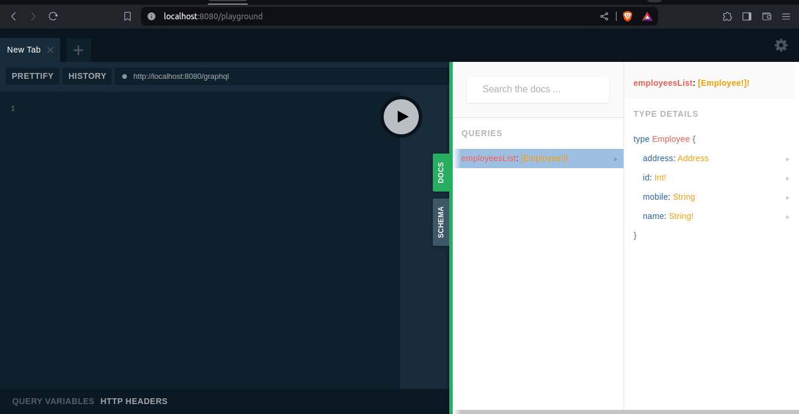
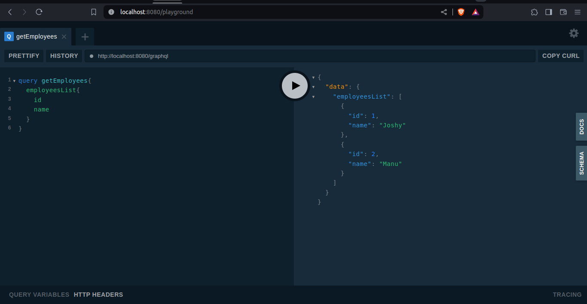

<!-- ABOUT THE PROJECT -->
## About The Project
### graphql-sample
This is a sample graphql application built with graphql-kotlin library.

### How to run ???

This project is using gradle, so you can run the following commands or use the IDE specific run configurations.
* Build the project
  ```sh
   ./gradlew clean build
  ```
* Run the project
  ```sh
   ./gradlew bootRun
  ```
* Open the following localhost URL
  ```sh
  http://localhost:8080/playground
  ```

### Screenshots
| Graphql query doccumentation   | Query response                                                     |
|--------------------------------|--------------------------------------------------------------------|
|  |  |
